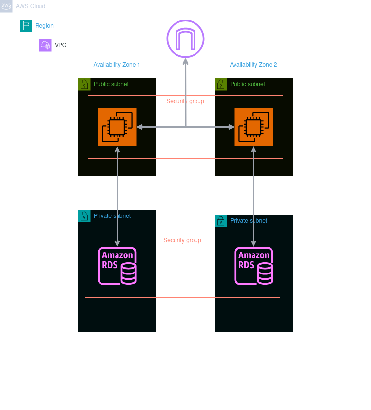

Update: I have created a CDK stack for the IAM infrastructure. Everything is working as expected. I will be creating a CDK stack for the main app and
then I will be creating a CDK stack for the S3 bucket and RDS. I will also be creating a CDK stack for the EC2 instance. I will also be creating a CDK
stack for the VPC. Everything in the IAM stack is now modular and can be used in other CDK stacks. This also makes it very easy to add new users and groups.

We will also implement an IAM infrastructure with security protocols in place for adding and removing staff
as and when needed. There is no information who or how many staff are required within this infrastructure, so for now will give principle of least
privilege to one group with read only access and one group with full access to the RDS for addition of client details and full S3 access for adding the main
app and any developments. After this discussions can be made with the company during and after implementation of what requirements are needed.

# Initial Steps
    Secure AWS account and make secure 'admim' account via console
    Using CDK with Typescript to implement the following
        Set up IAM groups and permissions
        Create VPC
        Create Private and public subnets in 2 Available Zones
        Add S3 to public subnets
        RDS to private subnets
        Allow connections from RDS to S3

# IAM user name/gropus and permissions added.

First steps with this project would be to secure the AWS account and establish principles of least privilege for all.
    Using the AWS console
        1. Secure main root account using MFA
        2. Create main Admin account again using MFA
        3. Create Admin account to actually create all the other users, keeping the main account safe
    Then using CDK Typescript, I have create all the accounts and permissions for each group. Permissions are based on principles of least privilege.
    In this project, I have create just 2 groups
        1. Main users with read only access to view client records
        2. Developers with full access to everything
    These are subject to change depending on the companies needed. The files are modular with this in mind, users can be added or removed at will
    and group files with permissions can be 'copy and paste' with only a small amount of editing.  
    The user names will have a randomly generated password that will be securely given to the user for first log in, then will be prompted to change
    password on that first log in. Then any other details can be added from there, such as email etc. We do not 'hard code' and personal information 
    or passwords. Security is of the up most importance.

The further I go with this project, the more I'm realising that my structure isn't the best and defining the users for the IAM policies in the Main
app in the bin directory, could also create issues down the line. I'm thinking a complete restructure and create a file explicitly for the creation
of the user names, then a function to call those names to a main IAM file before being referenced in a main file in the lib folder. This will keep
things clean and allow the main app file in bin to be just for set up. This will require a whole new structure and even new coding practices. As learning
this will help in the long term to be more secure, cleaner and more organised
